# Turning a dumb meter into a smart meter using Raspberry PI

How about introducing a bit of smart metering to your home to watch your energy consumption more closely? I liked the idea, but the place I live in has this piece of antique equipment installed in the basement:

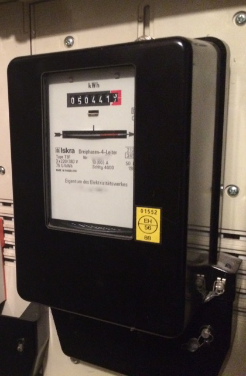

## The mission
I wanted to get a precise energy profile to get insight into the
different energy consumption devices used in our household of four. The more precise and higher
resolution the profile is, the easier it becomes to identify a
device turning on/off by just looking at the profile. A Raspberry Pi
with a camera device should be able to get a camera feed for the
meter. Add a bit of image processing and voila: smart metering.

## The power meter
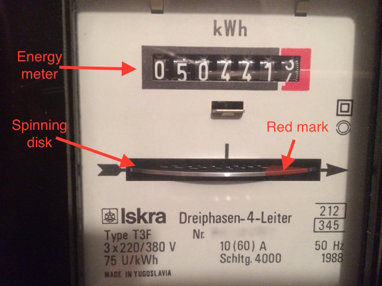

A closer look shows the panel features: The energy meter shows the
digits of the meter and a spinning disk indicating the currently consumed wattage
by adjusting its rotational speed. The disk makes 75 turns per kWh and
it has a little red mark painted onto it to facilitate reading.
The first idea was to read the digits and recognize the
current meter value, but the disk really gives a higher resolution
(75th of a kWh instead of tenths) plus the complexity of reading a red
mark and counting it is a bit lower than recognizing digits which
might only be half visible at times.

## Hardware

A Raspberry Pi model B first generation is almost well suited for the task. It
consumes little enough power itself and there are optimized image processing
libraries and many examples out in the internet. After setting up the
meter and watching for a while I noticed that the processing speed is
still not high enough to generate a frame rate that would catch every
passing of the mark through the window when lots of energy is used. A
newer generation 2 model B might therefore be more suited.

## Camera

The camera used is a cheap manual focus USB web cam with integrated LED lights
[cheap manual focus USB web cam with integrated LED lights](http://logilink.com/Products_LogiLink/Input_Devices_Multimedia/Webcams/Webcam_USB_with_LED_and_Microphone.htm)
which sells for about 10 Euros. Manual focus is helpful and the LED
lights are also useful for reading the meter in the dark basement. The
cheap sensor is really small which enables this little camera to focus
correctly on objects only a centimeter or two away.

The camera can be strapped directly onto the meter and still
illuminate the scene as well as get everything focussed.

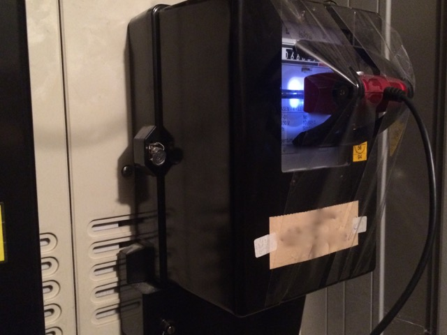

## OS and libraries

I installed Raspbian on the PI and decided to go with python as
programming language. It is well supported on the pi and has lots
of serious data processing libraries. This project uses

* [OpenCV](http://opencv.org). A computer vision library. Installation instructions can be found [here](http://www.pyimagesearch.com/2015/02/23/install-opencv-and-python-on-your-raspberry-pi-2-and-b/).
* [NumPy](http://numpy.org). Numeric computing in Python. Needed for image transformations
  plus OpenCV depends on this (see instructions for OpenCV).

## Image processing

After installing the hardware you can grab a few frames using

	code/grabframe.py

Most frames will look like this:

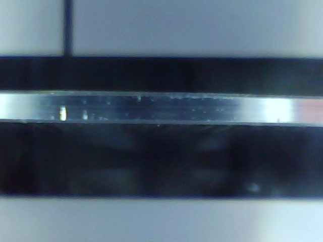

But eventually some action happens

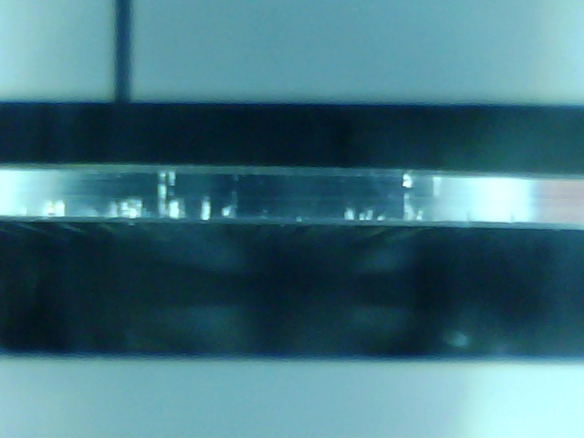
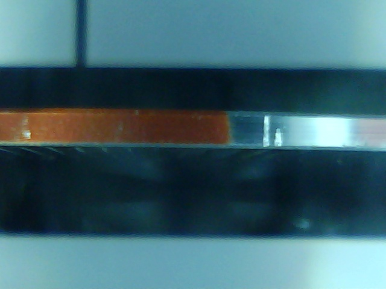
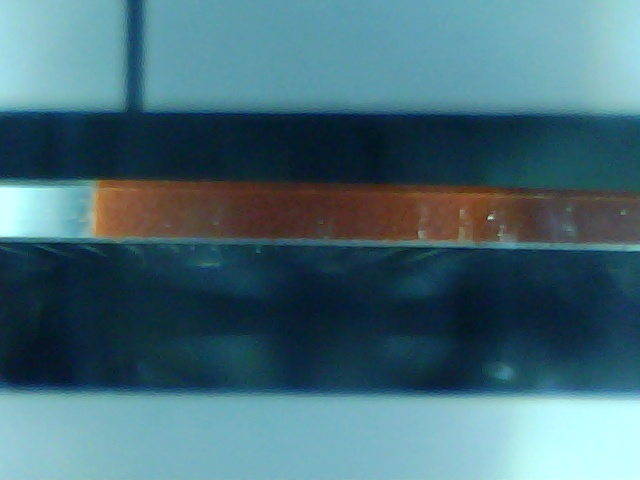
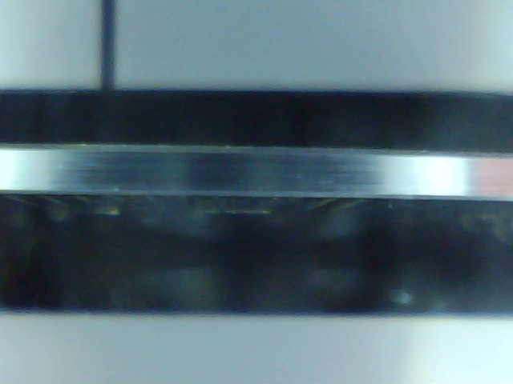
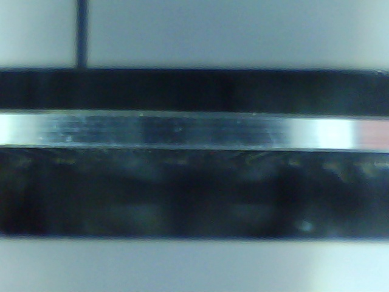

The goal is to identify frames containing the red mark. There are
several guides out there that describe how to identify an object based
on color in the image,
e.g. [here](https://opencv-python-tutroals.readthedocs.org/en/latest/py_tutorials/py_imgproc/py_colorspaces/py_colorspaces.html#converting-colorspaces)
Basically, it is advisable to transform the image to the HSV color
space and identify the color there.

I identified the colors

	lower_red = np.array([0,160,50])
	upper_red = np.array([60,255,255])

to work for my setup.

The script

	code/grabframe.py

also writes a version of the grabbed frame to disk where the
matched color is masked out. These masked image can be used to check
whether the selected color range works. The same images as above
with the mask applied. The black pixels in the red mark are the
applied mask, i.e. they stand for selected pixels.

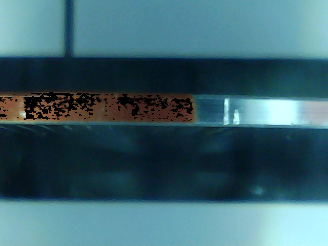
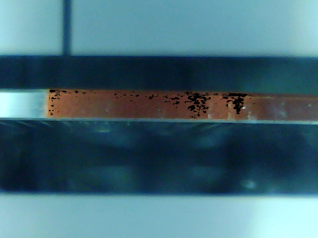

As you can see, the color choice only selects a small part of the red mark. But, since the negative detection works almost perfectly (i.e. zero selected
pixels when the mark is absent) the recognition works well enough.

The total number of masked pixels in the image can be counted by summing up the mask using numpy and the resulting 'redness' is a nice measure for the presence of the red mark.

See the code in

    code/processvid_pi.py

for the details.

The framerate is not good when grabbing and transforming the full sized image, therefore cropping the image to the smallest interesting region before processing it like described is advisable.

## Post processing

The above procedure yields a single number for each grabbed frame: The amount of red mark present in the current frame. This data is not really suited for the final application of plotting energy consumption, therefore some post processing is necessary.

Looking at this raw data is already very instructive: At night time
when energy consumption is low, it can take several hundred frames for
the mark to enter and exit the window again. The redness value start
at zero, then slowly increases and decreases again over hundreds of
values. The video capture sometimes produces errors and a single frame with redness 0 is captured although the mark is in the window. Therefore, two simple rules are used to identify  the start and the end of the mark passing through:

* The start of the mark is present in this frame, when in the previous frame no mark was present and the redness is larger than 10
* The end of the mark is detected, if the redness was zero in at least two consecutive frames

This logic is implemented in the class ModelState.

Each time the end of the mark passing through is detected, an event is triggered and written into the output file containing the timestamp and an estimated current wattage, based on the time passed since the previous event.

The script writes out the detected events to a CSV file, which is log-rolled daily.

## Graphs: One day's data

The data is not visualized very easily, because the power scale as well as the time scale span several magnitudes and all are to be considered: Hot water running draws up to 20kW while the standby consumption of always-on devices in the low single Watts is also costly. Below are three plots containing one day's data (plotted using [R](http://www.r-project.org)). The first one simply draws the log of the power consumption in W over time:

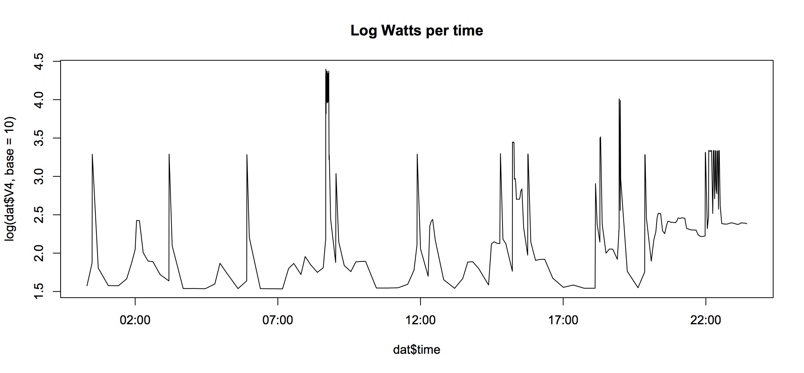

The very short high peak at around 9:00am has a significant contribution to this day's total energy usage. This can be seen in a plot showing the accumulated energy consumption of this day over time:

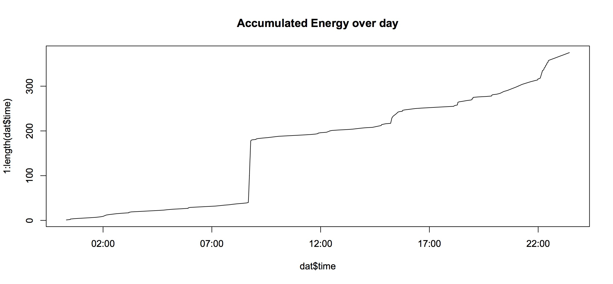

Another plot shows how much energy is consumed at which power level. Here, the power is plotted not against time as in the first plot, but against the disk turns. These are proportional to the consumed energy:

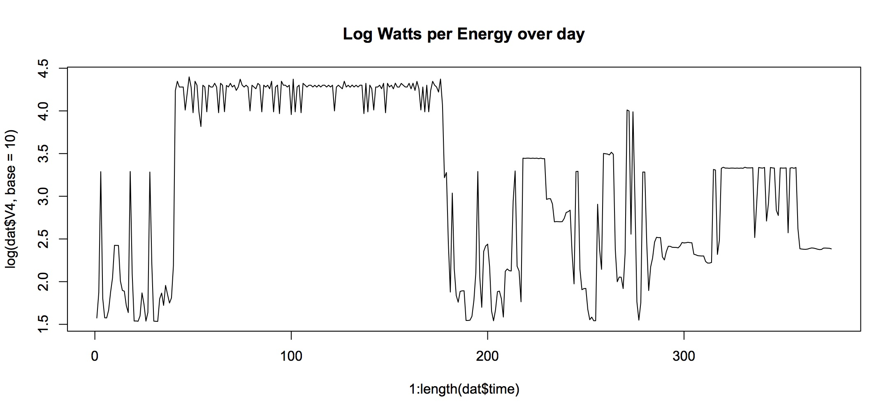

## Graphs: One year's data

For monitoring power usage, I use a small dashboard based on the D3 javascript library (code not shared).

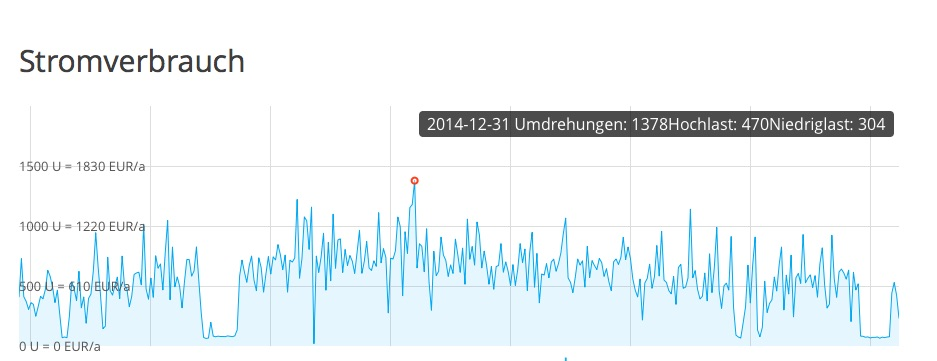

It shows a year's worth of daily energy usage data from July 2014 through July 2015. The dependency of the energy consumption on the outside temperature can be seen due to our hot water being heated different amounts (Germany, it can get cold in the winters and we have no AC in the summer), as well as two vacations where our flat was empty in autumn of 2014 and in July 2015. The peak consumption is on new years eve, where we had guests adding to the hot water consumption. The red circle moves on mouse-over and displays the selected day's consumption in total and for high wattage and lower wattage consumers.

## Conclusion

The solution works quite well and the Raspberry Pi runs stable for months and months. The only challenge has been to get the Pi to reliably connect to the wifi network for easy remote maintenance. I would probably recommend a USB wifi dongle with a larger antenna than the one I am currently using for remote metering locations.
